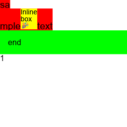

# Comet
Comet is a Rust GUI library.

## Core concepts
1. A `Node` is one of text or div and is a single available building block in Comet. Without introducing unnecessary `View` or `Widget` like traits.
2. A `Node` is composition of multiple props. By using archetypal ECS data structure, 
   1. It's horizontally scalable.
   2. It can be grouped in memory.
   3. Props can be queried efficiently.
3. Rich text is included and subset of css `block`/`inline` layout is provided.
4. Any stateless container layout algorithm can be applied to a `Node` via `ContainerLayoutFn`.

## Example
Render of `tree.rs` in `comet/examples`

## License
Comet is licensed under Apache-2.0